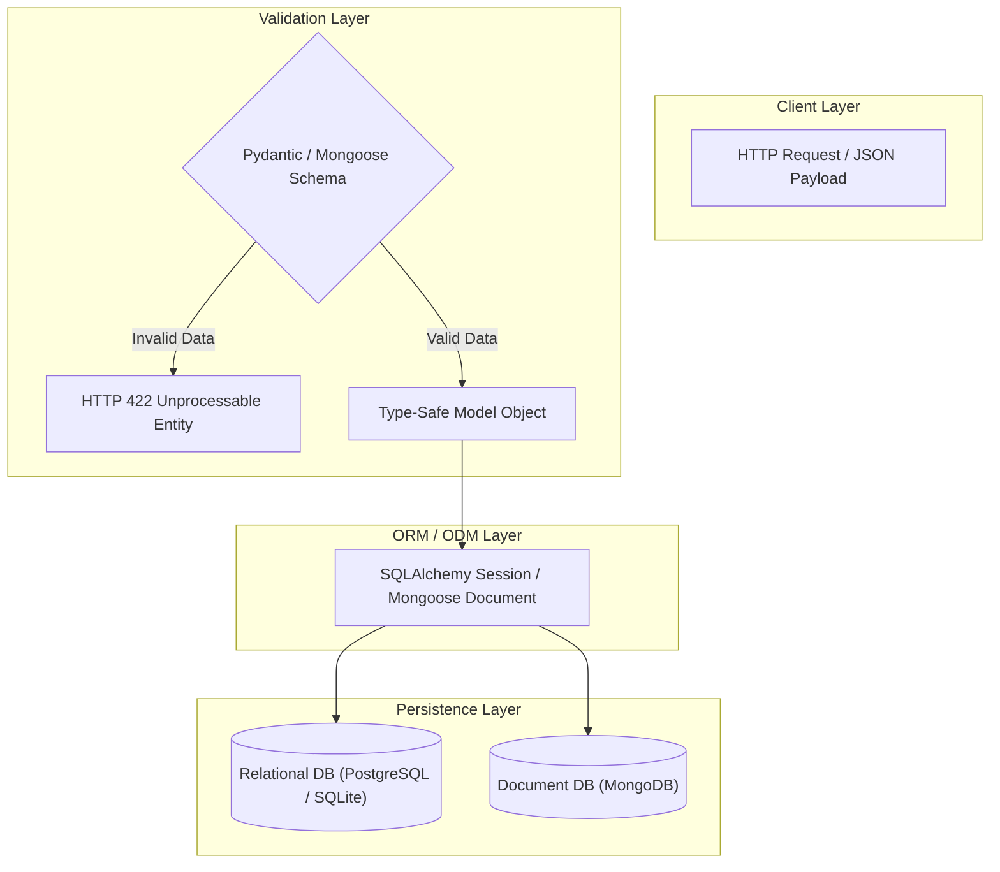

# Backend Development Hub 🚀

[](https://nodejs.org/)
[](https://expressjs.com/)
[](https://python.org/)
[](https://fastapi.tiangolo.com/)
[](https://flask.palletsprojects.com/)
[](https://www.sqlalchemy.org/)
[](https://www.mongodb.com/)
[](https://www.postgresql.org/)

A comprehensive, production-grade backend engineering curriculum and laboratory portfolio. This repository bridges modern web protocols, API architectures, server-side rendering, client/server state persistence, and full database modeling across both **Node.js / Express** and **Python (FastAPI, Flask, SQLAlchemy)** ecosystems.

---

## Table of Contents

- [Repository Architecture](#repository-architecture)
- [Technology Matrix](#technology-matrix)
- [Curriculum Breakdown](#curriculum-breakdown)
  - [1. Laboratory Experiments (`Lab/`)](#1-laboratory-experiments-lab)
  - [2. Theory Practical Curriculum (`Theory/`)](#2-theory-practical-curriculum-theory)
  - [3. Database Environments (`postgres/` & `psql/`)](#3-database-environments)
  - [4. Standalone Applications](#4-standalone-applications)
- [Quick-Start Execution Cheat Sheet](#quick-start-execution-cheat-sheet)
- [Data Modeling & Validation Highlights](#data-modeling--validation-highlights)

---

## Repository Architecture

```text
Backend Development/
├── Readme.md                             # Central Repository Guide & Showcase
├── package.json                          # Root Node.js dependencies
│
├── Lab/                                  # Laboratory Experiments & Full-Stack Projects
│   ├── Readme.md                         # Laboratory Curriculum Hub
│   ├── Experiment-1.html                 # Exp 1: Semantic HTML5 Elements & Forms
│   ├── Experiment_1_Readme.md            # Exp 1: Documentation & Specifications
│   │
│   ├── Experiment_12A/                   # Exp 12A: Express REST API & EJS SSR
│   │   ├── Readme.md                     # Exp 12A Overview
│   │   └── nodejs-express-lab/           # Full Express + EJS Application
│   │       ├── Readme.md                 # Node.js Express Lab Guide
│   │       ├── app.js                    # Route handlers & parameter processing
│   │       └── views/                    # EJS dynamic UI templates
│   │
│   ├── Experiment12_B/                   # Exp 12B: State Management
│   │   ├── Readme.md                     # Cookies & Sessions Documentation
│   │   ├── Cookies_example.js            # Client-side cookie handling (cookie-parser)
│   │   └── session_example.js            # Server-side session tracking (express-session)
│   │
│   └── lab_Assessment_B/                 # Lab Assessment: Eisenhower Matrix Todo App
│       ├── Readme.md                     # Full-stack architecture & API specs
│       ├── app.js                        # Express server with native MongoDB driver
│       └── views/                        # Dynamic priority matrix dashboard
│
├── Theory/                               # Academic Theory Tasks & Practical Implementations
│   ├── Readme.md                         # Theory Curriculum Hub
│   │
│   ├── Unit-1/                           # Unit 1: Foundations of Backend Development
│   │   └── Readme.md                     # Client-Server, HTTP Protocols & REST
│   │
│   ├── task-2/                           # Task 2: Student Management REST API in Flask
│   │   ├── Readme.md                     # Microframework routing & 404 handling
│   │   └── app.py                        # Flask API server
│   │
│   ├── Task_3/                           # Task 3: REST API with FastAPI & Uvicorn
│   │   ├── Readme.md                     # ASGI architecture & Swagger UI
│   │   └── main.py                       # FastAPI application
│   │
│   ├── Task_4/                           # Task 4: Nodemon Developer Workflow
│   │   └── Readme.md                     # File watching & hot-reloading DX
│   │
│   ├── ssr_demmo_Task_5/                 # Task 5: Server-Side Rendering (FastAPI + Jinja2)
│   │   ├── Readme.md                     # Jinja2 template interpolation & loops
│   │   ├── main.py                       # FastAPI SSR server
│   │   └── Templates/                    # Jinja2 HTML views
│   │
│   ├── Task-6/                           # Task 6: Client-Side State & Web Storage
│   │   ├── Readme.md                     # Storage mechanisms comparison
│   │   └── lecture7/                     # Lecture 7: To-Do App (localStorage vs sessionStorage)
│   │       ├── Readme.md
│   │       ├── index.html
│   │       └── script.js
│   │
│   ├── Lecture_15/                       # Lecture 15: Data Modeling (ORM & ODM)
│   │   ├── Readme.md                     # Conceptual, Logical, & Physical Data Modeling
│   │   └── ORM/                          # Complete ORM/ODM Implementations
│   │       ├── Readme.md                 # Master Guide (ER diagrams & CRUD analysis)
│   │       ├── Database.py               # SQLAlchemy Student Management & Cascade Deletion
│   │       ├── ecommerce_models.py       # PBL Activity: E-Commerce SQLAlchemy System
│   │       ├── ecommerce_mongoose.js     # PBL Activity: E-Commerce Mongoose ODM
│   │       ├── fastapi_pydantic_validation.py # Pydantic Request Validation (HTTP 201 & 422)
│   │       ├── test_fastapi_validation.py     # Automated Pydantic Validation Test Suite
│   │       ├── mongoose_models.js        # Mongoose Student & Blog (Post/Comment) Schemas
│   │       ├── physical_schema.sql       # PostgreSQL DDL with Constraints & Indexes
│   │       ├── save_to_mongodb.js        # MongoDB Compass populator script
│   │       └── run_all.py                # Unified Test Runner
│   │
│   └── Lecture_16/                       # Lecture 16: Database CRUD Operations
│       └── Readme.md                     # CRUD lifecycle, transactions, & pooling
│
├── nodejs-express-lab/                   # Root Standalone Express + EJS Lab Application
│   ├── Readme.md
│   ├── app.js
│   └── views/
│
├── express-demo/                         # Root Standalone Express Server Intro
│   ├── Readme.md
│   └── server.js
│
├── postgres/                             # PostgreSQL Python Virtual Environment
│   └── Readme.md                         # psycopg2 & SQLAlchemy driver configuration
│
└── psql/                                 # PostgreSQL Administration Environment
    └── Readme.md                         # psql CLI cheat sheet & schema management
```

---

## Technology Matrix

| Technology | Category | Role in Repository | Notable Characteristics |
| :--- | :--- | :--- | :--- |
| **Node.js** | Runtime | Primary JavaScript execution environment | Asynchronous, non-blocking I/O event loop |
| **Express.js** | Framework | REST APIs & SSR routing | Minimalist, unopinionated, extensive middleware |
| **Python** | Runtime | Data modeling & modern backend services | Strict typing, readability, extensive ecosystem |
| **FastAPI** | Framework | High-performance ASGI REST APIs | Auto OpenAPI/Swagger UI, Pydantic validation |
| **Flask** | Framework | Microframework REST APIs | Lightweight WSGI server, simple routing patterns |
| **SQLAlchemy** | ORM | Relational database mapping | `back_populates` relationships, cascade deletes |
| **Mongoose** | ODM | Document database modeling | Schema validation, regex matching, embedded models |
| **MongoDB** | Database | NoSQL document storage | Flexible JSON-like BSON documents, dynamic schemas |
| **PostgreSQL** | Database | Relational SQL database | ACID compliance, strict foreign keys, check constraints |
| **EJS / Jinja2** | Templating | Server-Side Rendering (SSR) | HTML generation with dynamic server variable injection |

---

## Curriculum Breakdown

### 1. Laboratory Experiments ([`Lab/`](file:///d:/Desktop/Backend%20Development/Lab/Readme.md))

* **[Experiment 1: Semantic HTML5 Elements & Web Forms](file:///d:/Desktop/Backend%20Development/Lab/Experiment_1_Readme.md)**: Semantic page structure (`<header>`, `<nav>`, `<section>`, `<footer>`), input validation types, native `<canvas>` 2D graphics, and HTML5 `<audio>`/`<video>` controls.
* **[Experiment 12A: Express REST API & EJS SSR](file:///d:/Desktop/Backend%20Development/Lab/Experiment_12A/Readme.md)**: Route parameters (`:id`), query parsing (`req.query` calculator), POST body handling, and dynamic template rendering.
* **[Experiment 12B: State Management](file:///d:/Desktop/Backend%20Development/Lab/Experiment12_B/Readme.md)**: Stateless HTTP mitigation using `cookie-parser` for client cookies and `express-session` for signed server-side session counters.
* **[Lab Assessment B: Eisenhower Matrix Application](file:///d:/Desktop/Backend%20Development/Lab/lab_Assessment_B/Readme.md)**: Production-style CRUD application integrating Express.js, EJS, and native MongoDB driver to manage priority-classified tasks.

---

### 2. Theory Practical Curriculum ([`Theory/`](file:///d:/Desktop/Backend%20Development/Theory/Readme.md))

* **[Unit 1: Foundations](file:///d:/Desktop/Backend%20Development/Theory/Unit-1/Readme.md)**: Network protocols, HTTP request/response cycle, status codes, and REST architectural constraints.
* **[Task 2: Flask REST API](file:///d:/Desktop/Backend%20Development/Theory/task-2/Readme.md)**: Python microframework routing, JSON responses with `jsonify()`, and custom 404 error handlers.
* **[Task 3: FastAPI REST API](file:///d:/Desktop/Backend%20Development/Theory/Task_3/Readme.md)**: High-concurrency ASGI service with Uvicorn and interactive Swagger UI at `/docs`.
* **[Task 4: Nodemon DX](file:///d:/Desktop/Backend%20Development/Theory/Task_4/Readme.md)**: File-watcher-based auto-reloading developer workflow.
* **[Task 5: Server-Side Rendering](file:///d:/Desktop/Backend%20Development/Theory/ssr_demmo_Task_5/Readme.md)**: Dynamic server-rendered HTML views using FastAPI and Jinja2 templates.
* **[Task 6 / Lecture 7: Web Storage API](file:///d:/Desktop/Backend%20Development/Theory/Task-6/lecture7/Readme.md)**: Browser storage comparison between persistent `localStorage` and session-scoped `sessionStorage`.
* **[Lecture 15: Data Modeling (ORM & ODM)](file:///d:/Desktop/Backend%20Development/Theory/Lecture_15/ORM/Readme.md)**:
  - **Conceptual, Logical, and Physical Models**: ER diagrams, data types, constraints, and PostgreSQL physical DDL.
  - **SQLAlchemy ORM**: Student Management System with bidirectional `back_populates` and cascade deletion verification.
  - **PBL Activity (E-Commerce System)**: Full shopping cart, checkout, and inventory workflow in SQLAlchemy and Mongoose.
  - **Validation Pipelines**: Pydantic request validation (HTTP 201 & 422 error interception) and Mongoose schema constraints.
* **[Lecture 16: Database CRUD Operations](file:///d:/Desktop/Backend%20Development/Theory/Lecture_16/Readme.md)**: ACID transaction management, connection pooling, and SQL vs NoSQL query patterns.

---

### 3. Database Environments

* **[`postgres/`](file:///d:/Desktop/Backend%20Development/postgres/Readme.md)**: Dedicated Python environment and connection guides for PostgreSQL database drivers (`psycopg2-binary`, `asyncpg`, `SQLAlchemy`).
* **[`psql/`](file:///d:/Desktop/Backend%20Development/psql/Readme.md)**: PostgreSQL CLI administration cheat sheet, user management, and schema migration commands.

---

## Quick-Start Execution Cheat Sheet

| Module | Location | Execution Command | Port / Access |
| :--- | :--- | :--- | :--- |
| **HTML5 Elements** | `Lab/` | `Start-Process Experiment-1.html` | Browser |
| **Express Lab 12A** | `Lab/Experiment_12A/nodejs-express-lab` | `npm install && node app.js` | `http://localhost:3000` |
| **Cookies Demo** | `Lab/Experiment12_B` | `node Cookies_example.js` | `http://localhost:3000/set-cookie` |
| **Sessions Demo** | `Lab/Experiment12_B` | `node session_example.js` | `http://localhost:3000` |
| **Eisenhower Todo** | `Lab/lab_Assessment_B` | `npm install && node app.js` | `http://localhost:3000` |
| **Flask API (Task 2)** | `Theory/task-2` | `python app.py` | `http://127.0.0.1:5000/students` |
| **FastAPI (Task 3)** | `Theory/Task_3` | `python main.py` | `http://127.0.0.1:8000/docs` |
| **FastAPI SSR (Task 5)** | `Theory/ssr_demmo_Task_5` | `python main.py` | `http://127.0.0.1:8000/` |
| **Web Storage To-Do** | `Theory/Task-6/lecture7` | `Start-Process index.html` | Browser |
| **SQLAlchemy ORM (L15)**| `Theory/Lecture_15/ORM` | `python Database.py` | CLI Output |
| **E-Commerce PBL (L15)** | `Theory/Lecture_15/ORM` | `python ecommerce_models.py` | CLI Output |
| **FastAPI Validation** | `Theory/Lecture_15/ORM` | `python test_fastapi_validation.py` | CLI Output (201 & 422) |
| **Mongoose ODM (L15)** | `Theory/Lecture_15/ORM` | `node mongoose_models.js` | CLI Output |
| **Lecture 15 All-in-One**| `Theory/Lecture_15/ORM` | `python run_all.py` | CLI Output |

---

## Data Modeling & Validation Highlights



* **Zero corrupted state:** Strict validation occurs before route handlers or persistence layers touch the database.
* **Cascade safety:** Child rows (e.g. enrollments, order items) are automatically cleaned up when parent records are deleted, preventing orphaned data.
* **Database Agnostic:** Switching between development (SQLite) and production (PostgreSQL) requires updating only the connection URI without rewriting domain logic.
