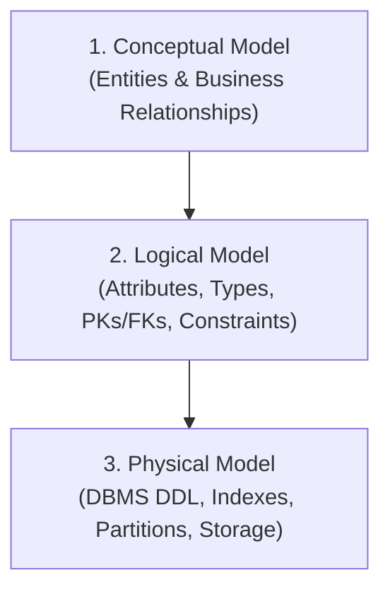
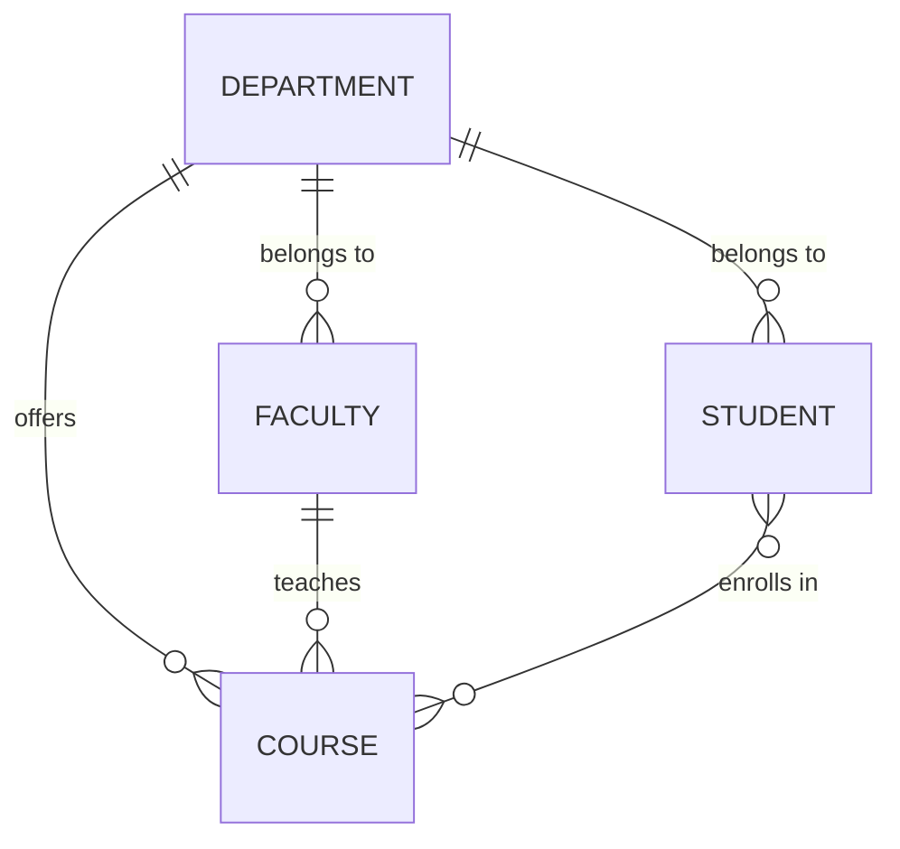
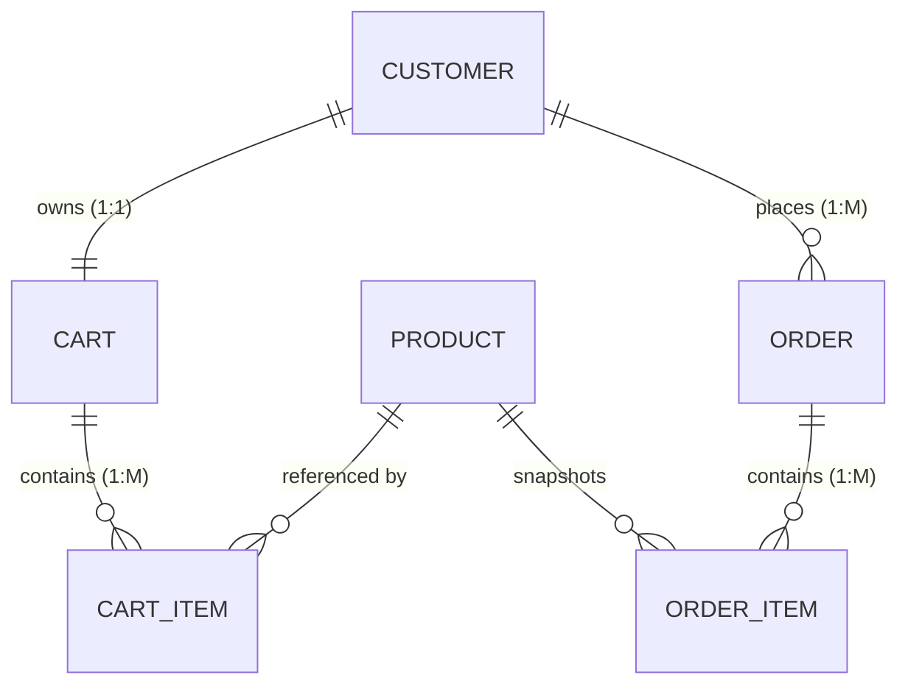

# Lecture 15: Data Modeling — Designing Models for Applications

> **Course Outcome:** **CO2** — Design data models that translate business requirements into database structures.  
> **Unit:** Unit 2 — Database Management  
> **Topic:** Data Modeling: Designing Models for Applications  
> **PBL Activity:** Modeling an E-Commerce system and implementing SQLAlchemy & Mongoose models  
> **Workspace Directory:** [`Theory/Lecture_15/ORM/`](file:///d:/Desktop/Backend%20Development/Theory/Lecture_15/ORM/)

---

## Table of Contents

1. [Introduction to Data Modeling](#1-introduction-to-data-modeling)
2. [Levels of Data Modeling](#2-levels-of-data-modeling)
   - [2.1 Conceptual Data Model](#21-conceptual-data-model)
   - [2.2 Logical Data Model](#22-logical-data-model)
   - [2.3 Physical Data Model](#23-physical-data-model)
3. [Translating Business Requirements to Data Models](#3-translating-business-requirements-to-data-models)
4. [Object-Relational Mapping (ORM) with SQLAlchemy](#4-object-relational-mapping-orm-with-sqlalchemy)
   - [4.1 SQLAlchemy Models & Relationships](#41-sqlalchemy-models--relationships)
   - [4.2 Complete CRUD Operations & Cascade Verification](#42-complete-crud-operations--cascade-verification)
5. [Object Document Modeling (ODM) with Mongoose (Node.js)](#5-object-document-modeling-odm-with-mongoose-nodejs)
   - [5.1 Student Schema with Built-in Validations](#51-student-schema-with-built-in-validations)
   - [5.2 Blog Application Models (Post & Comment)](#52-blog-application-models-post--comment)
6. [Data Model Validation](#6-data-model-validation)
   - [6.1 Pydantic Request Validation with FastAPI](#61-pydantic-request-validation-with-fastapi)
   - [6.2 Mongoose Schema Validation Rules](#62-mongoose-schema-validation-rules)
7. [PBL Activity: E-Commerce System Modeling](#7-pbl-activity-e-commerce-system-modeling)
   - [7.1 Architecture & Workflow](#71-architecture--workflow)
   - [7.2 SQLAlchemy Implementation](#72-sqlalchemy-implementation)
   - [7.3 Mongoose ODM Implementation](#73-mongoose-odm-implementation)
8. [Lab Exercise Solutions (Tasks 1 to 5)](#8-lab-exercise-solutions-tasks-1-to-5)
9. [How to Run & Verify All Modules](#9-how-to-run--verify-all-modules)

---

## 1. Introduction to Data Modeling

In database design, an ER diagram alone is not enough — backend applications require a way to interact with the database programmatically. **Data modeling** bridges the gap between business requirements and database implementation by defining how data is structured, stored, validated, and accessed in application code.

A data model serves as the **single source of truth** and architectural blueprint for both the database schema and application domain logic.

---

## 2. Levels of Data Modeling

Data modeling occurs across three progressive levels of abstraction:



| Level | Purpose | Audience | Key Components |
| :--- | :--- | :--- | :--- |
| **Conceptual** | High-level business overview; DBMS-agnostic | Stakeholders, Business Analysts | Entities, Business Relationships |
| **Logical** | Detailed structure with types and constraints; DBMS-agnostic | System Architects, Developers | Attributes, Data types, Primary/Foreign keys, Constraints |
| **Physical** | Concrete database implementation for specific DBMS | DBAs, Backend Engineers | SQL DDL, Indexes, Storage engines, Partitioning |

### 2.1 Conceptual Data Model

Identifies core business entities and high-level relationships without technical implementation specifics:



- `Student` **--Enrolls-->** `Course`
- `Faculty` **--Teaches-->** `Course`
- `Student` **--BelongsTo-->** `Department`

### 2.2 Logical Data Model

Adds data types, primary keys, foreign keys, and integrity rules:

```text
Student {
    id: INTEGER PRIMARY KEY,
    name: VARCHAR(100) NOT NULL,
    email: VARCHAR(100) UNIQUE NOT NULL,
    branch: VARCHAR(50),
    enrollment_date: DATE,
    department_id: INTEGER FOREIGN KEY -> Department(id)
}
```

### 2.3 Physical Data Model

Implemented in concrete SQL DDL for PostgreSQL/relational DBMS. Available in [`physical_schema.sql`](file:///d:/Desktop/Backend%20Development/Theory/Lecture_15/ORM/physical_schema.sql):

```sql
CREATE TABLE students (
    id SERIAL PRIMARY KEY,
    name VARCHAR(100) NOT NULL,
    email VARCHAR(100) UNIQUE NOT NULL,
    branch VARCHAR(50) NOT NULL,
    enrollment_date DATE DEFAULT CURRENT_DATE,
    department_id INTEGER REFERENCES departments(id) ON DELETE SET NULL,
    created_at TIMESTAMP WITH TIME ZONE DEFAULT CURRENT_TIMESTAMP,
    CONSTRAINT chk_enrollment_date CHECK (enrollment_date <= CURRENT_DATE)
);

CREATE INDEX idx_students_branch ON students(branch);
```

---

## 3. Translating Business Requirements to Data Models

The structured 6-step translation process:

1. **Identify Entities:** What real-world objects does the system manage? (`Student`, `Course`, `Faculty`, `Department`, `Enrollment`)
2. **Identify Attributes:** What properties describe each entity?
   - `Student`: `id`, `name`, `email`, `phone`, `branch`, `enrollment_date`
   - `Course`: `id`, `title`, `credits`, `department_id`
   - `Faculty`: `id`, `name`, `email`, `department_id`, `designation`
   - `Department`: `id`, `name`, `building`
   - `Enrollment`: `student_id`, `course_id`, `semester`, `grade`
3. **Identify Relationships:**
   - Department `1 : M` Students
   - Department `1 : M` Faculty
   - Department `1 : M` Courses
   - Faculty `1 : M` Courses
   - Student `M : N` Courses (resolved via `Enrollment` associative entity)
4. **Define Constraints:**
   - Student email must be unique
   - Course credits must be between 1 and 6 (`CHECK (credits BETWEEN 1 AND 6)`)
   - Grade must be `A+, A, B+, B, C+, C, D, F, or NULL`
   - Enrollment date cannot be in the future
5. **Choose Data Types:** Use precision types (`SERIAL`/`INTEGER`, `VARCHAR`, `DATE`, `NUMERIC`)
6. **Create the Model:** Translate into ER diagrams, SQL DDL, and ORM/ODM code.

---

## 4. Object-Relational Mapping (ORM) with SQLAlchemy

**File:** [`Database.py`](file:///d:/Desktop/Backend%20Development/Theory/Lecture_15/ORM/Database.py)

ORM maps Python classes to relational database tables, automatically generating SQL queries, enforcing relationships, and abstracting database specifics.

### 4.1 SQLAlchemy Models & Relationships

Key design technique: `back_populates` establishes **bidirectional navigation** between linked models, while `cascade="all, delete-orphan"` guarantees data integrity when parents are deleted:

```python
class Student(Base):
    __tablename__ = "students"
    
    id = Column(Integer, primary_key=True)
    name = Column(String(100), nullable=False)
    email = Column(String(100), unique=True, nullable=False)
    branch = Column(String(50))
    enrollment_date = Column(Date)
    department_id = Column(Integer, ForeignKey("departments.id"))
    
    department = relationship("Department", back_populates="students")
    enrollments = relationship("Enrollment", back_populates="student", cascade="all, delete-orphan")
```

### 4.2 Complete CRUD Operations & Cascade Verification

The script [`Database.py`](file:///d:/Desktop/Backend%20Development/Theory/Lecture_15/ORM/Database.py) executes all CRUD operations and verifies cascade behavior:

```python
# 1. CREATE: Department, Course, Student with Department assignment & Enrollment
dept = Department(name="Computer Science & Engineering", building="Block 9")
session.add(dept)
session.commit()

student = Student(name="Aarav", email="aarav@upes.ac.in", branch="CSE",
                  enrollment_date=date(2024, 8, 1), department_id=dept.id)
session.add(student)
session.commit()

# 2. READ: Filtering by branch and fetching by primary key
cse_students = session.query(Student).filter(Student.branch == "CSE").all()
student_by_id = session.query(Student).filter_by(id=student.id).first()

# 3. UPDATE: Modifying student branch
student_by_id.branch = "ECE"
session.commit()

# 4. DELETE & CASCADE VERIFICATION:
# Deleting student automatically purges their child enrollment rows
session.delete(student_by_id)
session.commit()
```

#### Output Verification:
```text
[OK] Database tables created successfully.
--- 1. CREATE: Department & Course ---
Created Department: <Department(id=1, name='Computer Science & Engineering')>
Created Faculty: <Faculty(id=1, name='Dr. Sharma', designation='Associate Professor')>
Created Courses: <Course(id='CS101', title='Data Structures & Algorithms', credits=4)>

--- 2. CREATE: Student with Department Assignment ---
Student added: <Student(id=1, name='Aarav', branch='CSE', email='aarav@upes.ac.in')> assigned to Department: 'Computer Science & Engineering'
Enrolled Aarav into CS101: <Enrollment(student_id=1, course_id='CS101', semester='Semester 3', grade='A')>

--- 3. READ: Retrieving Data ---
Retrieved student (ID 1): Aarav
Retrieved all CSE students: ['Aarav', 'Priya']

--- 4. UPDATE: Modifying Student Branch ---
Updated branch in DB: Student Aarav -> ECE

--- 5. DELETE & CASCADE BEHAVIOR VERIFICATION ---
Enrollments before student deletion for Student ID 1: [<Enrollment(student_id=1, course_id='CS101')>]
Executed session.delete(student_to_delete) for 'Aarav'.
Student exists in DB? False
Enrollments after student deletion for Student ID 1: []
[SUCCESS] Cascade verified: All child enrollment records were automatically removed!
```

---

## 5. Object Document Modeling (ODM) with Mongoose (Node.js)

**Files:** [`mongoose_models.js`](file:///d:/Desktop/Backend%20Development/Theory/Lecture_15/ORM/mongoose_models.js), [`package.json`](file:///d:/Desktop/Backend%20Development/Theory/Lecture_15/ORM/package.json)

ODM maps JavaScript objects to MongoDB documents in flexible, JSON-like formats while enforcing schema structure and data integrity.

### 5.1 Student Schema with Built-in Validations

```javascript
const studentSchema = new mongoose.Schema({
  name: {
    type: String,
    required: [true, 'Name is required'],
    trim: true,
    minlength: [1, 'Name cannot be empty'],
    maxlength: [100, 'Name cannot exceed 100 characters']
  },
  email: {
    type: String,
    required: [true, 'Email is required'],
    unique: true,
    lowercase: true,
    match: [/^\S+@\S+\.\S+$/, 'Invalid email format']
  },
  branch: {
    type: String,
    required: [true, 'Branch is required'],
    enum: {
      values: ['CSE', 'ECE', 'IT', 'ME', 'CE'],
      message: '{VALUE} is not a valid engineering branch'
    }
  },
  age: {
    type: Number,
    min: [17, 'Minimum age is 17'],
    max: [30, 'Maximum age is 30']
  },
  enrollmentDate: { type: Date, default: Date.now },
  courses: [{ type: mongoose.Schema.Types.ObjectId, ref: 'Course' }]
}, { timestamps: true });
```

### 5.2 Blog Application Models (Post & Comment)

Fulfills **Lab Exercise Task 4 & 5**:

```javascript
const commentSchema = new mongoose.Schema({
  author: { type: String, required: [true, 'Comment author is required'], trim: true },
  content: { type: String, required: [true, 'Comment content cannot be empty'], minlength: 2, maxlength: 500 },
  createdAt: { type: Date, default: Date.now }
});

const postSchema = new mongoose.Schema({
  title: { type: String, required: true, minlength: 3, maxlength: 200, trim: true },
  slug: { type: String, lowercase: true, trim: true },
  content: { type: String, required: true },
  author: { type: String, required: true, trim: true },
  category: {
    type: String,
    required: true,
    enum: ['Backend', 'Database', 'Cloud', 'Architecture', 'Tutorial']
  },
  status: {
    type: String,
    enum: ['draft', 'published', 'archived'],
    default: 'draft'
  },
  tags: [{ type: String, lowercase: true }],
  comments: [commentSchema] // Embedded subdocuments
}, { timestamps: true });
```

#### Output Verification:
```bash
node mongoose_models.js
```
```text
[TEST 1] Testing VALID Student Document:
[PASS] Valid Student passed all schema validations successfully!

[TEST 2] Testing INVALID Student Document (Catching Constraints):
[PASS] Mongoose correctly intercepted and rejected invalid data:
  * Field [name]: Name is required (Kind: required)
  * Field [email]: Invalid email format (Kind: regexp)
  * Field [branch]: CIVIL is not a valid engineering branch (Kind: enum)
  * Field [age]: Minimum age is 17 (Kind: min)

[TEST 3] Testing VALID Blog Post with Embedded Comments:
[PASS] Valid Blog Post and embedded comments passed validation!

[TEST 4] Testing INVALID Blog Post:
[PASS] Mongoose correctly caught invalid blog post fields:
  * Field [title]: Title must be at least 3 characters
  * Field [content]: Post content is required
  * Field [category]: InvalidCategory is not an accepted category
  * Field [status]: Status must be either draft, published, or archived
```

---

## 6. Data Model Validation

Validation guarantees that corrupted or malformed data never enters the database.

### 6.1 Pydantic Request Validation with FastAPI

**Files:** [`fastapi_pydantic_validation.py`](file:///d:/Desktop/Backend%20Development/Theory/Lecture_15/ORM/fastapi_pydantic_validation.py), [`test_fastapi_validation.py`](file:///d:/Desktop/Backend%20Development/Theory/Lecture_15/ORM/test_fastapi_validation.py)

FastAPI validates incoming JSON payloads against Pydantic models before route handlers execute:

```python
class StudentCreate(BaseModel):
    name: str = Field(..., min_length=1, max_length=100)
    email: EmailStr
    branch: str = Field(..., pattern=r"^(CSE|ECE|IT|ME|CE)$")
    enrollment_date: Optional[date] = None

class StudentResponse(BaseModel):
    id: int
    name: str
    email: str
    branch: str
    enrollment_date: date

@app.post("/students", response_model=StudentResponse, status_code=201)
def create_student(student: StudentCreate):
    ...
```

#### Client Fetch Example (Slide 12):
```javascript
fetch("http://127.0.0.1:8000/students", {
  method: "POST",
  headers: { "Content-Type": "application/json" },
  body: JSON.stringify({
    name: "Rahul",
    email: "rahul@example.com",
    branch: "CSE",
    enrollment_date: "2026-09-29"
  })
})
.then(res => res.json())
.then(data => console.log(data))
.catch(err => console.error(err));
```

#### Test Suite Output (Automated Verification):
```text
[TEST 1] Submitting VALID student payload:
Response Status Code: 201
[PASS] Successfully created student with 201 Created!

[TEST 2] Submitting DELIBERATELY INVALID payload:
Response Status Code: 422 (Expected: 422 Unprocessable Entity)
[PASS] Verified 422 Unprocessable Entity! All invalid fields were rejected:
  * Field [body -> name]: String should have at least 1 character (Type: string_too_short)
  * Field [body -> email]: value is not a valid email address (Type: value_error)
  * Field [body -> branch]: String should match pattern '^(CSE|ECE|IT|ME|CE)$' (Type: string_pattern_mismatch)
  * Field [body -> enrollment_date]: Input should be a valid date or datetime (Type: date_from_datetime_parsing)
```

---

## 7. PBL Activity: E-Commerce System Modeling

**Files:** [`ecommerce_models.py`](file:///d:/Desktop/Backend%20Development/Theory/Lecture_15/ORM/ecommerce_models.py), [`ecommerce_mongoose.js`](file:///d:/Desktop/Backend%20Development/Theory/Lecture_15/ORM/ecommerce_mongoose.js)

### 7.1 Architecture & Workflow



1. **Entities:**
   - `Customer`: Buyer contact details & addresses
   - `Product`: Catalog items with price, inventory stock, category
   - `Cart & CartItem`: Active session shopping bag
   - `Order & OrderItem`: Immutable placed orders capturing point-in-time prices
2. **Lifecycle Workflow:**
   - Customer adds items to active Cart
   - Customer checks out -> System creates Order & OrderItems, deducts inventory stock, empties the shopping cart
   - Queries order history with item breakdown

---

## 8. Lab Exercise Solutions (Tasks 1 to 5)

| Task | Requirement | Implemented Solution |
| :--- | :--- | :--- |
| **Task 1** | Conceptual data model for an E-Commerce System with `Product`, `Order`, `Customer`, `Cart` | Fully designed with Mermaid ER diagram and implemented in [`ecommerce_models.py`](file:///d:/Desktop/Backend%20Development/Theory/Lecture_15/ORM/ecommerce_models.py) and [`ecommerce_mongoose.js`](file:///d:/Desktop/Backend%20Development/Theory/Lecture_15/ORM/ecommerce_mongoose.js) |
| **Task 2** | SQLAlchemy models for Student Management System with proper relationships | Implemented in [`Database.py`](file:///d:/Desktop/Backend%20Development/Theory/Lecture_15/ORM/Database.py) with `Department`, `Faculty`, `Student`, `Course`, `Enrollment` models using `back_populates` |
| **Task 3** | Implement CRUD operations with SQLAlchemy:<br>1. Create student with department assignment<br>2. Retrieve all students in a branch<br>3. Update student branch<br>4. Delete student and verify cascade behavior | Fully executed and verified in [`Database.py`](file:///d:/Desktop/Backend%20Development/Theory/Lecture_15/ORM/Database.py). Output explicitly verifies child `Enrollment` records are deleted when the parent student is removed |
| **Task 4** | Mongoose schemas for Blog Application with `Post` and `Comment` models | Implemented in [`mongoose_models.js`](file:///d:/Desktop/Backend%20Development/Theory/Lecture_15/ORM/mongoose_models.js) with embedded comment subdocuments, tags array, categories, and timestamps |
| **Task 5** | Add validation rules to ensure data integrity (required fields, unique constraints, enum values) | Enforced across Pydantic ([`fastapi_pydantic_validation.py`](file:///d:/Desktop/Backend%20Development/Theory/Lecture_15/ORM/fastapi_pydantic_validation.py)) and Mongoose ([`mongoose_models.js`](file:///d:/Desktop/Backend%20Development/Theory/Lecture_15/ORM/mongoose_models.js)), tested with automated test suites catching 422 HTTP and Mongoose validation errors |

---

## 9. How to Run & Verify All Modules

All commands can be run directly from the PowerShell terminal inside `Theory/Lecture_15/ORM`:

```powershell
# Navigate to the ORM directory
cd "d:\Desktop\Backend Development\Theory\Lecture_15\ORM"

# 1. Run SQLAlchemy Student Management CRUD & Cascade Verification
python Database.py

# 2. Run PBL E-Commerce SQLAlchemy Model & Order Lifecycle
python ecommerce_models.py

# 3. Run FastAPI & Pydantic Validation Test Suite (Asserts 201 & 422)
python test_fastapi_validation.py

# 4. Run Mongoose ODM Student & Blog Models Validation
node mongoose_models.js

# 5. Run Mongoose E-Commerce ODM Validation
node ecommerce_mongoose.js
```

---

## Data Modeling Best Practices Summary

| Practice | Description | Example / Application |
| :--- | :--- | :--- |
| **Start with requirements** | Understand business needs before designing models | Identify cardinality (1:1, 1:M, M:N) first |
| **Use meaningful names** | Descriptive names improve team collaboration | `enrollment_date` instead of `ed` |
| **Normalize appropriately** | Avoid redundancy without excessive join penalties | 3NF for transactions, denormalization for fast read views |
| **Add timestamps** | Critical for audit trails and cache invalidation | `created_at` and `updated_at` |
| **Use enums for fixed values** | Restricts columns to controlled domain values | Status (`draft`, `published`, `archived`) |
| **Index frequently queried fields** | Boosts lookup performance on large tables | `CREATE INDEX idx_students_branch ON students(branch);` |
| **Plan for scale** | Consider data volume growth and partition strategies | UUIDs / BigInt, document subdocuments vs references |
| **Document your models** | Clear ER diagrams and schema documentation | Code comments, Mermaid diagrams, API schemas |
