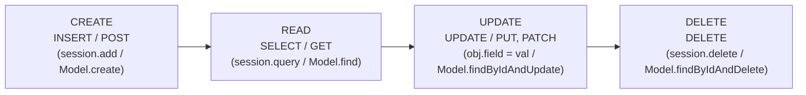

# Lecture 16: CRUD Operations — Create, Read, Update, Delete in Databases

> **Unit:** Unit 2 — Database Management  
> **Course Outcome:** **CO2** — Implement persistent database interactions using ORM and ODM frameworks.  
> **Location:** [`Theory/Lecture_16/`](file:///d:/Desktop/Backend%20Development/Theory/Lecture_16/)

Following **Lecture 15 (Data Modeling)**, this lecture focuses on translating conceptual, logical, and physical data models into production **CRUD (Create, Read, Update, Delete)** operations across both relational (PostgreSQL/SQLite via SQLAlchemy) and document-based (MongoDB via Mongoose) database systems.

---

## CRUD Operations Lifecycle

| Operation | HTTP Verb | SQL Equivalent | SQLAlchemy (Python) | Mongoose (Node.js) | Status Codes |
| :--- | :--- | :--- | :--- | :--- | :--- |
| **Create** | `POST` | `INSERT INTO table ...` | `session.add(obj); session.commit()` | `await Model.create(doc)` | `201 Created` |
| **Read (All)** | `GET` | `SELECT * FROM table` | `session.query(Model).all()` | `await Model.find({})` | `200 OK` |
| **Read (One)** | `GET` | `SELECT * FROM table WHERE id = ?` | `session.query(Model).get(id)` | `await Model.findById(id)` | `200 OK` / `404 Not Found` |
| **Update** | `PUT` / `PATCH` | `UPDATE table SET ... WHERE id = ?` | `obj.attr = val; session.commit()` | `await Model.findByIdAndUpdate(id, data)` | `200 OK` / `204 No Content` |
| **Delete** | `DELETE` | `DELETE FROM table WHERE id = ?` | `session.delete(obj); session.commit()` | `await Model.findByIdAndDelete(id)` | `200 OK` / `204 No Content` |

---

## Key Learning Topics & Best Practices

1. **Transactional Integrity & ACID Properties:**
   - Atomic commits and automatic rollbacks upon database exceptions.
   - Managing session lifecycles (`commit`, `flush`, `rollback`, `close`).

2. **Cascade Behavior & Foreign Key Constraints:**
   - Preventing orphaned child records using `cascade="all, delete-orphan"` in SQLAlchemy and middleware pre-hooks in Mongoose.

3. **Query Optimization & Pagination:**
   - Preventing full-table memory exhaustion by using pagination (`LIMIT`, `OFFSET` / `.skip()`, `.limit()`).
   - Projection: Querying only needed columns/fields rather than entire rows (`SELECT id, name` / `.select('name email')`).

4. **Database Connection Pooling:**
   - Maintaining persistent pools of connections rather than paying TCP/SSL connection overhead on every HTTP request.

---

## Practical Implementation Links

* Data models and base CRUD demonstrations are available in [`Theory/Lecture_15/ORM/`](file:///d:/Desktop/Backend%20Development/Theory/Lecture_15/ORM/).
* PostgreSQL administration commands are detailed in [`psql/Readme.md`](file:///d:/Desktop/Backend%20Development/psql/Readme.md).
* Python PostgreSQL connection drivers are configured in [`postgres/Readme.md`](file:///d:/Desktop/Backend%20Development/postgres/Readme.md).
